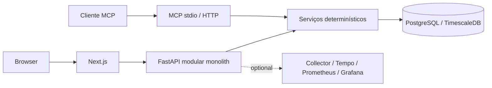

# N55 Intelligence Lab

**Vehicle Intelligence Platform** — engenharia automotiva orientada a dados.
A primeira implementação será estudada com uma BMW 335i F30/N55. O objetivo é transformar
telemetria e documentação em análises explicáveis e auditáveis.

## Estado atual

Fases 0–5 passaram pela auditoria retrospectiva. A Fase 6 expõe ferramentas e resources MCP
somente leitura; a evidência de entrega está no [relatório de aceitação](docs/validation/phase-6-acceptance.md).
A Fase 5 fornece analytics determinísticos e versionados sobre telemetria, sessões, pulls,
eventos factuais e configurações históricas. A Fase 4 fornece aquisição somente leitura,
receitas, preflight e streaming durável. Diagnóstico/root cause, agentes, RAG e ML
permanecem planejados. Veja [a arquitetura de analytics](docs/architecture/phase-5-automotive-analytics.md).
Veja [a arquitetura de telemetria](docs/architecture/phase-1-telemetry.md) e o
[desenho de análise da Fase 2](docs/architecture/phase-2-session-analysis.md) e o
[desenho de eventos da Fase 3](docs/architecture/phase-3-event-anomaly-engine.md), o
[desenho de aquisição da Fase 4](docs/architecture/phase-4-live-acquisition.md), além do
[relatório histórico da Fase 0](docs/roadmap/phase-0-completion-report.md).



## Quick start

Node 24.19.0, pnpm 11.19.0, Python 3.12.14, uv 0.12.19, Docker/Compose v2 e Make.

```bash
make bootstrap
make up
```

Web http://localhost:3000 · API http://localhost:8000/docs.
`make down` preserva dados locais. `.env` contém apenas configuração local e não deve ser versionado.

## Desenvolvimento e testes

`make check-api`, `make check-web`, `make contracts`, `make test-integration` e `make verify`.
No Codex Cloud, use `make verify-cloud` para todos os checks que não dependem de containers.
O workflow GitHub Actions `full-validation` é o executor canônico de Docker/full-stack; checks
dependentes de Docker permanecem `CI REQUIRED` até esse workflow passar.
Instale Chromium e scanners conforme [desenvolvimento local](docs/development/local-development.md)
e [automação de segurança](docs/security/automation.md). O gate completo requer Docker e downloads públicos.

## Observabilidade

`make observability-up` habilita o profile opcional. Grafana: http://localhost:3001.
Veja [instrumentação e verificação](docs/observability/README.md).

## Arquitetura e continuidade

[Contexto](docs/architecture/system-context.md) · [toolchain](docs/architecture/toolchain.md) ·
[ADRs](docs/adr) · [testes](docs/testing/strategy.md) · [threat model](docs/security/threat-model.md) ·
[roadmap](docs/roadmap/README.md) · [contribuição](CONTRIBUTING.md).

## Safety boundary

Observação, diagnóstico, análise, simulação, pesquisa e recomendações técnicas.
Nenhum controle de acelerador, freios, direção, tuning ou flash/ECU automático.
Dados veiculares podem ser incompletos ou ruidosos; conclusões futuras devem indicar evidência e incerteza.

## Phase 6 MCP

The read-only MCP interface exposes 22 typed tools and three contextual JSON resources through
stdio and authenticated Streamable HTTP, using official SDK 2.0.0. It preserves Phase 5 evidence
and provenance without persisting reads. No LLM, agent, RAG or diagnosis is added.
See [architecture](docs/architecture/phase-6-mcp-tool-platform.md),
[runbook](docs/runbooks/mcp-server.md) and [acceptance](docs/validation/phase-6-acceptance.md).
Run `make test-mcp`, `make phase6-acceptance`, `make test-mcp-e2e`, `make benchmark-mcp`.
`make mcp-up` starts the optional container process with a provisioned local token.

## Phase 7A grounded agent

Delivery is in progress: see [acceptance status](docs/validation/phase-7a-acceptance.md).
The vehicle workspace supports natural-language questions, bounded progress/streaming, confidence,
grounded findings, configuration/modification context, evidence and MCP audit. One typed LangGraph
orchestrator uses the official MCP client and a provider adapter. The real adapter uses OpenAI
Responses; reproducible CI uses the same graph with a deterministic provider. Agent execution is
disabled by default and requires explicit server-side provider/MCP configuration.

The agent reads actual vehicle facts through MCP. The catalog now has 23 tools with the additive
configuration-list read. Temporal association never proves mechanical causation. No ECU control,
unsupported diagnosis, adaptive logging, specialist agents or RAG is available.
See [architecture](docs/architecture/phase-7a-grounded-agent.md) and
[operation/configuration](docs/runbooks/grounded-agent.md).
