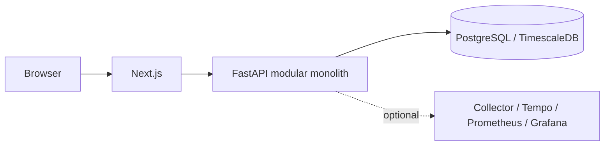

# N55 Intelligence Lab

**Vehicle Intelligence Platform** — engenharia automotiva orientada a dados.
A primeira implementação será estudada com uma BMW 335i F30/N55. O objetivo é transformar
telemetria e documentação em análises explicáveis e auditáveis.

## Estado atual

Fases 0–5 estão implementadas. A auditoria retrospectiva antes da Fase 6 está em andamento;
implementação e testes verdes, isoladamente, não comprovam todos os critérios de aceitação.
A Fase 5 fornece analytics determinísticos e versionados sobre telemetria, sessões, pulls,
eventos factuais e configurações históricas. A Fase 4 fornece aquisição somente leitura,
receitas, preflight e streaming durável. Diagnóstico/root cause, MCP, agentes, RAG e ML
permanecem planejados. Veja [a arquitetura de analytics](docs/architecture/phase-5-automotive-analytics.md).
Veja [a arquitetura de telemetria](docs/architecture/phase-1-telemetry.md) e o
[desenho de análise da Fase 2](docs/architecture/phase-2-session-analysis.md) e o
[desenho de eventos da Fase 3](docs/architecture/phase-3-event-anomaly-engine.md), o
[desenho de aquisição da Fase 4](docs/architecture/phase-4-live-acquisition.md), além do
[relatório histórico da Fase 0](docs/roadmap/phase-0-completion-report.md).



## Quick start

Node 24.19.0, pnpm 11.19.0, Python 3.12.14, uv 0.12.19, Docker/Compose v2 e Make.

```bash
make bootstrap
make up
```

Web http://localhost:3000 · API http://localhost:8000/docs.
`make down` preserva dados locais. `.env` contém apenas configuração local e não deve ser versionado.

## Desenvolvimento e testes

`make check-api`, `make check-web`, `make contracts`, `make test-integration` e `make verify`.
No Codex Cloud, use `make verify-cloud` para todos os checks que não dependem de containers.
O workflow GitHub Actions `full-validation` é o executor canônico de Docker/full-stack; checks
dependentes de Docker permanecem `CI REQUIRED` até esse workflow passar.
Instale Chromium e scanners conforme [desenvolvimento local](docs/development/local-development.md)
e [automação de segurança](docs/security/automation.md). O gate completo requer Docker e downloads públicos.

## Observabilidade

`make observability-up` habilita o profile opcional. Grafana: http://localhost:3001.
Veja [instrumentação e verificação](docs/observability/README.md).

## Arquitetura e continuidade

[Contexto](docs/architecture/system-context.md) · [toolchain](docs/architecture/toolchain.md) ·
[ADRs](docs/adr) · [testes](docs/testing/strategy.md) · [threat model](docs/security/threat-model.md) ·
[roadmap](docs/roadmap/README.md) · [contribuição](CONTRIBUTING.md).

## Safety boundary

Observação, diagnóstico, análise, simulação, pesquisa e recomendações técnicas.
Nenhum controle de acelerador, freios, direção, tuning ou flash/ECU automático.
Dados veiculares podem ser incompletos ou ruidosos; conclusões futuras devem indicar evidência e incerteza.
