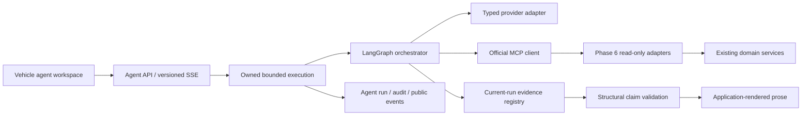

# Phase 7A grounded agent

Phase 7B adds a separate, operator-approved investigation to a completed grounded AgentRun.
Its evidence search, source capability, Phase 4 recipe and follow-up boundaries are specified in
[Phase 7B investigation and adaptive logging](phase-7b-investigation-adaptive-logging.md).
The Phase 7A answer and evidence contract remains the source of the investigation threshold.

Delivery status and executed evidence are recorded in [acceptance](../validation/phase-7a-acceptance.md).
The lasting decisions are [ADR 0019](../adr/0019-grounded-agent-state-and-evidence.md).

## Boundaries

`agents` obtains vehicle facts only through authenticated MCP discovery and calls. Its repository
accesses only `agent_runs`, `agent_tool_calls` and `agent_stream_events`. Migration 0009 is additive;
its downgrade removes only these tables. Vehicle facts, telemetry and deterministic analytics remain
owned by their existing modules. No domain writes, diagnosis engine, RAG, specialist agents or
adaptive logging are introduced.

Discovery validates the shared Phase 6 tool catalog and read-only annotations. `list_vehicles` is
excluded from the selected-vehicle model context. A new bounded configuration-list tool exposes
existing configuration intervals. Server capability version is 1.1.0; the envelope remains 1.0.
Existing tools keep their schemas and behavior.

## Context and evidence

Context reads actual identity/engine/platform, bounded configurations/modifications, relevant sessions
and capabilities. Configuration and installation intervals use `[start, end)` semantics. An overlapping,
absent or incorrectly assigned session configuration is marked uncertain. Removed parts remain
historical records and are associated only with sessions inside their installation intervals.

Each evidence record has a current run/vehicle identity, UUID, source entity, originating tool-call
UUID, source fingerprint, fact paths and units, provenance, quality warnings and truncation flag.
Notes, VIN and nickname cannot be fact bindings. Nested vehicle identities are validated too.
Analytics use the `agent-summary-v1` projection: summary metrics, sufficiency and limitations are
preserved; large profiles and the pairwise comparability matrix are excluded. The original record
fingerprint and selected pull IDs are retained. The deterministic analytics result already aggregates
comparability failures into sufficiency/limitations. A genuinely truncated fact projection remains
marked incomplete and cannot support a temporal association.

Claims bind exact paths/values/units to cited evidence. Numeric tolerance is 1e-6. Association requires
complete sufficient comparison evidence, both actual compared configurations, and temporally valid
session context. It always states that causation is unproven. A thermal hypothesis requires numeric
thermal and acceleration/duration bindings and complete quality evidence. Unsupported conclusions
and diagnostic classifications are rejected. Missing values are displayed as unavailable.

The model produces a bounded typed draft. All public prose is rendered using fixed application
templates after validation. Invalid grounding gets a bounded correction attempt, then fails safely.
Provider-native responses and private reasoning are never canonical state or persisted data.

## Execution and lifecycle

Defaults: 16 model steps, 32 MCP calls, 1 telemetry window, 3 comparisons, 4 concurrent runs,
90 seconds overall, 30 seconds per model turn and 12 seconds per MCP call. Hard bounds are enforced
by `AgentSettings`. Context requires four reads plus capabilities when a session exists. Simple
questions exit after one model turn; complex questions reuse already validated pull evidence.
Identical normalized calls reuse their deterministic result. Telemetry requires a previous summary.

Run and tool status are persisted. Terminal status and terminal SSE event commit atomically.
Disconnecting SSE leaves bounded execution running; explicit cancellation stops it. Reconnect uses
the sequence cursor. Reads reconcile abandoned runs older than 190 seconds into a failed state,
without restarting tools or reusing old evidence in a new run. Public history is limited to 20 runs,
audit to 32 calls, events to 400, facts to 160 per evidence, and database operations to five seconds.

This is a single API worker execution owner. It is not a distributed scheduler or durable graph
checkpoint system. A restarted process can retrieve results and classify interrupted runs but does
not resume provider execution. No promise of multi-worker cancellation is made.

## Provider and streaming contracts

OpenAI Responses uses the official async SDK, streaming function calls and a JSON draft, with
`store=false` and SDK retries disabled. Code owns retry/time/size budgets. The deterministic provider
uses the same typed adapter, MCP client, graph and grounding path. It is forbidden in production mode.
Token counters are populated when supplied; unavailable usage/cost stays null. Deterministic usage
is explicitly zero; this is not an estimate of external model costs.

Agent answer and SSE schemas are version 1.0. Events contain public progress, tool audit summaries,
evidence references and validated answer chunks. Sequence replay is idempotent for clients; it never
executes tools again. Generated OpenAPI/TypeScript contracts are authoritative.

Configured provider and MCP secrets are removed from model input and public snapshots by recursively
redacting string values and keys. Numeric JSON facts retain their original values and types. This is
an additional protection for known configured secrets, not arbitrary secret discovery in user data.
Facts omitted by list/depth/string/path bounds are marked incomplete. Source quality flags,
insufficient calculations and low completeness lower confidence and prohibit stronger interpretations.
`unsafe_operation_refused` is an application-rendered fixed refusal without factual bindings.

Agent persistence owns its own connection engine with `NullPool`, no connection reuse and no pre-ping query. Each session has a
five-second deadline; an asyncpg driver watchdog terminates an owned connection if cancellation
cleanup exceeds that deadline by 50 ms. This prevents an unresponsive database from holding an
HTTP request indefinitely. Acquisition has the bounded driver connect/command timeouts.
Grounding failure metrics count each rejected draft, including successful correction attempts.
Every selected pull must match its own temporally valid session/configuration pair.
