# Phase 7B investigation and adaptive logging

Phase 7B extends the single Phase 7A grounded agent. It starts from a completed AgentRun whose
validated answer has material missing evidence. The application persists public investigation
artifacts only; it does not persist model reasoning or expose acquisition commands to a model.
The lasting boundary decision is [ADR 0020](../adr/0020-investigation-recipe-and-approval-boundary.md).

```mermaid
flowchart LR
  A[Grounded AgentRun] --> B[Typed semantic proposal]
  B --> C[Validate current-run evidence IDs]
  C --> D[Existing evidence through MCP]
  D --> E[Source capability snapshot]
  E --> F[Phase 4 recipe catalog and preflight]
  F --> G[Versioned investigation approval]
  G --> H[Existing read-only acquisition]
  H --> I[Finalized DrivingSession]
  I --> J[New grounded AgentRun]
  J --> K[Deterministic hypothesis update]
```

## Domain and persistence

`InvestigationPlan` holds the originating run and vehicle, effective configuration, optional source
session, bounded hypotheses, normalized gaps, semantic signal needs, source capability snapshot,
Phase 4 recipe reference, approval, linked session, separate reanalysis run and public outcome.
It caps hypotheses at five, gaps at twelve, signal needs at sixteen, capture cycles at one and
snapshot versions at one hundred. It stores transition timestamps. Migration 0010 adds its own
plan, event and session-link tables after the existing agent migration; no earlier table or
Timescale hypertable is rewritten. Repository updates use an expected version and commit the
new public event atomically. Session link and reanalysis run reservation use row locks.

The lifecycle is `DRAFT → EVIDENCE_GAPS_IDENTIFIED → CAPABILITIES_RESOLVED → RECIPE_PROPOSED →
AWAITING_APPROVAL → APPROVED → ACQUISITION_READY → AWAITING_DATA → DATA_RECEIVED → REANALYZING →
COMPLETED/INCONCLUSIVE`. Rejection, cancellation and failure are explicit terminal paths.
An unavailable or unknown source may remain at `CAPABILITIES_RESOLVED` until a later refresh.
Recipe replacement after approval invalidates approval and returns to `AWAITING_APPROVAL` before
data linkage. Replacement after linkage is rejected.

## Evidence and capability policy

The provider proposes bounded categories, current-run evidence IDs and semantic roles. Application
code supplies fixed public wording. Unknown roles, malformed indexes, cross-run evidence IDs,
low-quality cited evidence and telemetry roles on technical-documentation gaps are rejected.
The investigation calls `get_session_capabilities` through the actual Phase 6 MCP client for
compatible completed sessions and recognizes sufficient deterministic comparison evidence from
the originating run. A signal absent from one recording does not imply source incapability.

The semantic registry maps to canonical telemetry keys. Ignition timing is a known canonical import
field but is not collectable through a current Phase 4 recipe; it remains an explicit unavailable
need. A collector capability snapshot is matched by vehicle, effective configuration, adapter and
source reference. A connected collector heartbeat or a local read-only OBD preflight registered
with the operator token can provide the snapshot. Snapshots older than one day are unknown;
heartbeat snapshots also require a connected state. The preflight report is operator-authenticated,
not cryptographically attested, so approval and the collector both recheck it. Synthetic
capability is available only in deterministic test/development mode. Source support and historical
session recording are stored separately. Approval rechecks the source snapshot. The local collector
still performs its own preflight before reading.

Phase 4 owns the final `LoggingRecipe` objects, configuration hashes, signal requirements, rates,
preflight and Sampling Planner. Phase 7B selects a catalog recipe that covers collectable semantic
needs and reports required missing needs, dropped needs and rate compromises. It cannot insert a
provider-authored signal or Hz value into acquisition. Feasible and feasible-with-degradation
plans may be approved. Partial, blocked or unverified plans cannot be marked ready.

## Approval and follow-up

The investigation API requires a separate single-operator token for every read, mutation and SSE
connection. The token is never persisted or included in plan output. This is a local single-operator
boundary, not multi-tenant identity. Approval binds the current plan version and exact recipe hash;
repeated approval of the same ready hash is idempotent. Approval does not start the collector.

The operator starts the existing Phase 4 local/manual read-only acquisition with the approved recipe.
Linkage accepts a finalized acquisition only when its vehicle, configuration, adapter, source
reference, recipe key/version/hash and start time match the approved plan. The canonical session
must have completed Phase 4 finalization. Linkage is idempotent. The follow-up AgentRun is a new
record reserved atomically with the investigation link; the original answer stays immutable.
The follow-up uses the original question, the linked session and a bounded public category summary.
New MCP evidence and canonical Phase 3 event types can support or weaken hypotheses. Absence of an
event is used only with a complete event read and checked signal quality. Mechanical causes remain
unproven. A single capture cycle prevents autonomous recursion.

Phase 7C specialist agents, Phase 7D comprehensive real-model validation and Phase 8 document RAG
are outside this architecture.
