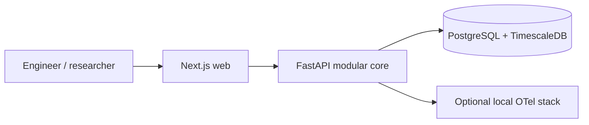

# System context

N55 Intelligence Lab is the first Vehicle Intelligence Platform implementation, using a BMW
335i F30 with N55 engine as a future test vehicle. Engineers, vehicle owners and researchers
will compare telemetry and maintenance evidence. No real vehicle data is collected in Phase 0.

Current users view API/database/build status. Future sources include OBD observations and
batch log files; later integrations include streaming, technical documentation, MCP tools and agents.

Safety: observation, diagnosis, analysis, comparison, simulation, research and recommendations only.
No automatic ECU writing/flashing/tuning, throttle/brake/steering or critical driving commands.
Vehicle inputs may be missing, inaccurate or noisy. Future outputs must distinguish observed fact,
calculation, statistical anomaly, hypothesis, recommendation and confirmed conclusion.
